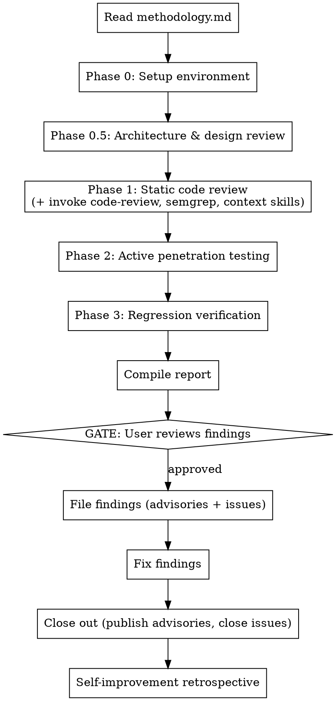

# Security Assessment

## Overview

Four-phase AI-assisted security assessment methodology: architecture & design review, static code review, active penetration testing, and regression verification. Produces structured findings with CVSS 3.1 scores and OWASP WSTG coverage. Self-improving — each assessment run contributes lessons back to the methodology.

**Core principle:** Test EVERYTHING empirically. Reading code is not enough. If the code says `SameSite=Strict`, verify it in actual response headers.

**Second principle:** Understand the design before reviewing the code. The most critical vulnerabilities are often architectural — what data flows where, what's trusted implicitly, what accumulates over time. No amount of `grep` finds a missing encryption-at-rest requirement.

**Announce at start:** "I'm using the security-assessment skill to conduct this review."

## Limitations — Read This First

**This is an AI-assisted security assessment, not a replacement for human expertise.** It can find a reasonable number of bad design decisions and obvious code mistakes, but it is not equivalent to an assessment by a qualified security engineer.

**What this skill is good at:**
- Systematic coverage — it won't forget to check security headers or CORS config
- Architecture-level analysis — data lifecycle, trust boundaries, privacy claims vs. reality
- Pattern matching — known vulnerability patterns (XSS, injection, auth bypass) in common frameworks
- Analogous system research — finding prior art and known issues in similar projects
- Structured reporting — consistent CVSS, CWE, PoC format for every finding
- Volume — it can read every file and test every endpoint without getting tired

**What this skill cannot do:**
- Discover novel vulnerability classes or zero-day exploitation techniques
- Perform sophisticated logic analysis (complex race conditions, crypto protocol flaws, timing attacks beyond basic checks)
- Understand business context the way a domain expert would
- Replace a professional penetration test for compliance or high-stakes targets
- Guarantee completeness — absence of findings does not mean absence of vulnerabilities

**Use this as:** A first pass that closes the obvious gaps and builds a structured foundation for human review, not as a final verdict on security posture.

**Announce in every report:** Include a limitations section stating this was an AI-assisted assessment and recommending professional human review for production/compliance needs.

## Skill Integration

If other skills are available in your environment, use them to bolster coverage:

| Capability | When to invoke | What it adds |
|------------|---------------|-------------|
| Code review skill | During Phase 1, dispatch as a parallel agent on critical files | Catches code quality issues and convention violations that pure security focus misses |
| Static analysis rule authoring (Semgrep, etc.) | When a finding pattern could be expressed as a reusable rule | Creates detection for the vulnerability class across future code |
| Code search (Sourcegraph, GitHub search, etc.) | During Phase 0.5, search for the same patterns across other repos | Identifies whether the issue is systemic or isolated |
| Framework-specific context skills | During Phase 1, for framework-specific checks | Framework-specific security knowledge (Django CSRF, Spring actuators, Express prototype pollution) |

**How to integrate:** After Phase 0.5 generates investigation priorities, check if any available skill matches a priority. Invoke it as part of Phase 1 rather than duplicating its expertise.

## When to Use

- Full security assessment of a web application
- Triaging code scanning alerts (CodeQL, Semgrep)
- Filing or closing out GitHub Security Advisories
- Regression-testing prior security fixes
- Pre-release security review

**When NOT to use:**
- General code review (use a dedicated code review skill or tool)
- Dependency-only vulnerability scanning (use `pip audit` / `npm audit` directly)
- Threat modeling without code (use a threat model framework)

## The Process

**This skill is rigid.** All four phases run. No skipping "because the code looks clean" or "the architecture is simple."

## Quick Reference

| Phase | What | Parallelizable? |
|-------|------|----------------|
| 0 | Build, run, authenticate against target | No |
| 0.5 | Architecture & design review: data lifecycle, trust boundaries, privacy claims, analogous systems | No |
| 1 | Static review: auth, crypto, SSRF, input validation, WebSocket, config, Docker, error handling, AI patterns, **AI agent tool use**, **config-as-attack-surface** (+ invoke available review/analysis skills) | Yes (per category) |
| 2 | Active testing: JWT attacks, SSRF bypass, XSS, headers, WebSocket, config injection, dependency scan, code scanning triage | Yes (per category) |
| 3 | Regression: verify all prior fixes still hold | Yes (per finding) |

## How to Use

1. **Read the full methodology:** `references/methodology.md` in this skill directory contains the complete reference: all test categories, commands, output format, filing protocol, and self-improvement process.

2. **First assessment on a project?** Use the "Adapting This Prompt" section in methodology.md to map the target's attack surface and generate project-specific test commands.

3. **Returning to a project?** Check for a project-specific `docs/security-assessment-prompt.md` — it may contain customized file paths, pre-identified concerns, and lessons from prior runs.

4. **Dispatch agents for parallel work:** Phase 1 categories and Phase 2 attack categories are independent. Use subagents for parallel static review (Read/Grep only) and run active tests in the main session (requires Bash for curl/Docker).

## Severity Filing Protocol

| Severity | Where to File |
|----------|--------------|
| Critical / High | GitHub Security Advisory (private disclosure) |
| Medium | Security Advisory (preferred) or private issue |
| Low / Informational | Public GitHub Issue |

**Advisory lifecycle:** Draft -> Fix -> **Published** (with `patched_versions`). Published = correct terminal state. Closed = dismissed/invalid. Never close a real finding.

## Red Flags

| Thought | Reality |
|---------|---------|
| "Code looks correct, skip active testing" | Code review misses runtime behavior. Test it. |
| "Phase 3 is overkill, fixes are obvious" | Regressions happen silently. Verify every prior fix. |
| "I'll file findings as I go" | Complete the full assessment first, then file. Prevents duplicates. |
| "This is a small app, quick scan is enough" | Small apps have the same vulnerability classes. Full methodology. |
| "docker exec whoami shows root, that's the finding" | `docker exec` runs as root by default. Check `/proc/1/status` for actual PID 1 UID. |
| "The advisory is filed, we're done" | Draft advisories are invisible. Publish with `patched_versions` after fixing. |
| "The architecture is simple, skip to code review" | Simple architectures have the worst data hygiene. The Recall disaster was architecturally trivial. |
| "It's localhost only, so no auth needed" | Localhost is a mitigating control, not an excuse to skip access control. Local malware, browser extensions, and DNS rebinding bypass it. |
| "The README says it's privacy-first, skip privacy analysis" | Claims analysis exists specifically to verify marketing against implementation. Trust but verify. |
| "No similar system exists, skip analogous comparison" | Search harder. Screen capture -> Recall. Note-taking -> Evernote breaches. Local AI -> prompt injection research. |
| "This AI assessment is thorough enough, ship it" | This is a first pass. Recommend human expert review for anything going to production or requiring compliance. |

## Error Handling

| Condition | Action |
|-----------|--------|
| Docker not running | Stop. Assessment requires a running target. |
| `gh` CLI not authenticated | Stop. Filing requires `gh auth login`. |
| Sub-agents denied Bash access | Run Docker/curl in main session. Dispatch agents for static review only (Read/Grep). |
| `websockets` not installed | Test WebSocket auth via static code review of ws.py. |
| GitHub rate-limited inside Docker | Expected for update checker tests. Note as accepted behavior. |
| No prior assessment history | Skip Phase 3. Note in report as "first assessment." |
| No README/docs available | Skip claims analysis (category 4). Note gap in report. |
| WebSearch unavailable | Skip analogous system comparison (category 5). Note gap and recommend manual research. |
| Target has no network component | Skip supply chain CDN checks. Focus on filesystem data lifecycle. |
| Target is not yet running | Phase 0.5 does NOT require a running target. Proceed with code-only analysis. |
| Code review skill not available | Proceed without it. Note in report that code-level review was security-focused only. |

## Self-Improvement

After every assessment, append an "Appendix: Prompt Improvement Recommendations" to the report. These are **proposals, not automatic changes.**

**MANDATORY: Present proposed improvements to the user and wait for explicit approval before modifying any skill files.** The user may accept, reject, or modify each proposal. Only apply approved changes to:
1. `references/methodology.md` in this skill directory (universal improvements)
2. `references/lessons-learned.md` for run-specific notes and tool workarounds
3. The project's `docs/security-assessment-prompt.md` if it exists (project-specific improvements)

See the full retrospective protocol in `references/methodology.md`.
