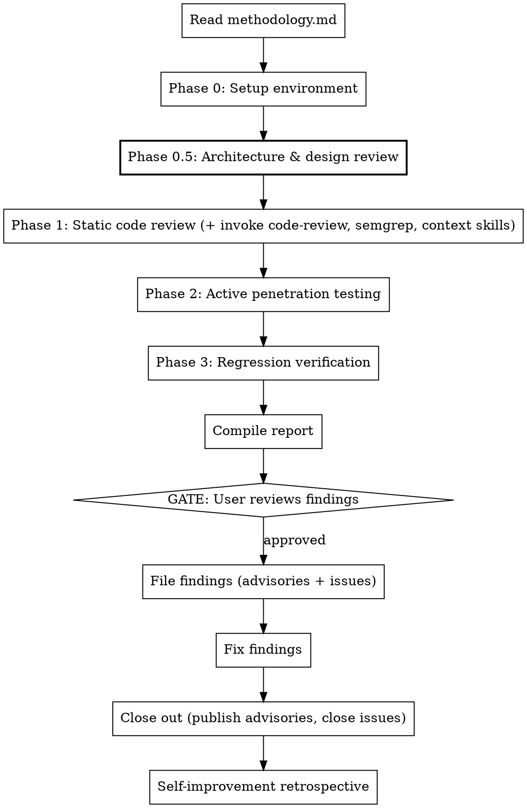

# Architecture Review Phase — Implementation Plan

> **For Claude:** REQUIRED SUB-SKILL: Use superpowers:executing-plans to implement this plan task-by-task.

**Goal:** Add a mandatory "Phase 0.5: Architecture & Design Review" to the security-assessment skill, add honest limitations framing, and integrate with other available skills (code-review, semgrep, etc.) to bolster coverage.

**Architecture:** Two files to modify — `SKILL.md` (the skill entry point) and `methodology.md` (the full reference). The new phase content goes into methodology.md between "Environment Setup" and "Phase 1: Static Code Review". SKILL.md gets updated references, flow diagram, limitations section, and skill integration guidance.

**Tech Stack:** Markdown files only. No code changes.

**Key framing change:** This assessment is AI-assisted, not AI-replacing-human. It catches bad design decisions and obvious code mistakes but is not a substitute for a qualified human security engineer. The skill must say this clearly.

---

### Task 1: Update SKILL.md — Limitations, Overview, and Skill Integration

**Files:**
- Modify: `~/.claude/skills/security-assessment/SKILL.md`

**Step 1: Update the overview paragraph**

Replace line 10:
```markdown
Three-phase white-box security assessment methodology: static code review, active penetration testing, and regression verification. Produces structured findings with CVSS 3.1 scores and OWASP WSTG coverage. Self-improving — each assessment run contributes lessons back to the methodology.
```

With:
```markdown
Four-phase AI-assisted security assessment methodology: architecture & design review, static code review, active penetration testing, and regression verification. Produces structured findings with CVSS 3.1 scores and OWASP WSTG coverage. Self-improving — each assessment run contributes lessons back to the methodology.
```

Add after the existing core principle line:

```markdown
**Second principle:** Understand the design before reviewing the code. The most critical vulnerabilities are often architectural — what data flows where, what's trusted implicitly, what accumulates over time. No amount of `grep` finds a missing encryption-at-rest requirement.
```

**Step 2: Add Limitations section immediately after Overview**

Insert a new section after the overview block and before "When to Use":

```markdown
## Limitations — Read This First

**This is an AI-assisted security assessment, not a replacement for human expertise.** It can find a reasonable number of bad design decisions and obvious code mistakes, but it is not equivalent to an assessment by a qualified security engineer.

**What this skill is good at:**
- Systematic coverage — it won't forget to check security headers or CORS config
- Architecture-level analysis — data lifecycle, trust boundaries, privacy claims vs. reality
- Pattern matching — known vulnerability patterns (XSS, injection, auth bypass) in common frameworks
- Analogous system research — finding prior art and known issues in similar projects
- Structured reporting — consistent CVSS, CWE, PoC format for every finding
- Volume — it can read every file and test every endpoint without getting tired

**What this skill cannot do:**
- Discover novel vulnerability classes or zero-day exploitation techniques
- Perform sophisticated logic analysis (complex race conditions, crypto protocol flaws, timing attacks beyond basic checks)
- Understand business context the way a domain expert would
- Replace a professional penetration test for compliance or high-stakes targets
- Guarantee completeness — absence of findings does not mean absence of vulnerabilities

**Use this as:** A first pass that closes the obvious gaps and builds a structured foundation for human review, not as a final verdict on security posture.

**Announce in every report:** Include a limitations section stating this was an AI-assisted assessment and recommending professional human review for production/compliance needs.
```

**Step 3: Add Skill Integration section after Limitations**

Insert after the new Limitations section:

```markdown
## Skill Integration

This skill should leverage other available skills to bolster its coverage. Check which skills are available and invoke them where applicable:

| Skill | When to invoke | What it adds |
|-------|---------------|-------------|
| `code-review` | During Phase 1 — dispatch as a parallel agent reviewing changed/critical files | Catches code quality issues, logic errors, and convention violations that pure security focus misses |
| `author-semgrep-rule` | When a finding pattern could be expressed as a static analysis rule | Creates reusable detection for the vulnerability class |
| `sourcegraph` | During Phase 0.5 — search for the same vulnerability patterns across other repos | Identifies whether the issue is systemic or isolated |
| `python-context` / `java-context` / `js-context` | During Phase 1 — for framework-specific security checks | Provides framework-specific security knowledge (Django CSRF, Spring actuators, Express prototype pollution) |

**How to integrate:** After Phase 0.5 generates investigation priorities, check if any available skill matches a priority. If so, invoke it as part of Phase 1 rather than duplicating its expertise with generic code review.
```

**Step 4: Update the process flow diagram**

Replace the existing `digraph assessment` with:


**Step 5: Update the rigid statement**

Change to:
```markdown
**This skill is rigid.** All four phases run. No skipping "because the code looks clean" or "the architecture is simple."
```

**Step 6: Update the Quick Reference table**

Replace with:
```markdown
| Phase | What | Parallelizable? |
|-------|------|----------------|
| 0 | Build, run, authenticate against target | No |
| 0.5 | Architecture review: data lifecycle, trust boundaries, STRIDE-lite, privacy/claims, analogous systems, supply chain, data volume | Partially (categories 4-7 parallel) |
| 1 | Static review + skill integration: auth, crypto, SSRF, input validation, WebSocket, config, Docker, error handling, AI patterns. Invoke code-review, semgrep, and framework context skills where available. | Yes (per category) |
| 2 | Active testing: JWT attacks, SSRF bypass, XSS, headers, WebSocket, config injection, dependency scan, code scanning triage | Yes (per category) |
| 3 | Regression: verify all prior fixes still hold | Yes (per finding) |
```

**Step 7: Add architecture-specific red flags**

Append to Red Flags table:
```markdown
| "The architecture is simple, skip to code review" | Simple architectures have the worst data hygiene. The Recall disaster was architecturally trivial. |
| "It's localhost only, so no auth needed" | Localhost is a mitigating control, not an excuse to skip access control. Local malware, browser extensions, and DNS rebinding bypass it. |
| "The README says it's privacy-first, skip privacy analysis" | Claims analysis exists specifically to verify marketing against implementation. Trust but verify. |
| "No similar system exists, skip analogous comparison" | Search harder. Screen capture → Recall. Note-taking → Evernote breaches. Local AI → prompt injection research. |
| "This AI assessment is thorough enough, ship it" | This is a first pass. Recommend human expert review for anything going to production or requiring compliance. |
```

**Step 8: Add error handling entries**

Append to Error Handling table:
```markdown
| No README/docs available | Skip claims analysis (category 4). Note gap in report. |
| WebSearch unavailable | Skip analogous system comparison (category 5). Note gap and recommend manual research. |
| Target has no network component | Skip supply chain CDN checks. Focus on filesystem data lifecycle. |
| Target is not yet running | Phase 0.5 does NOT require a running target. Proceed with code-only analysis. |
| code-review skill not available | Proceed without it. Note in report that code-level review was security-focused only. |
```

**Step 9: Update Self-Improvement section in SKILL.md**

Replace the existing Self-Improvement section with:
```markdown
## Self-Improvement

After every assessment, append an "Appendix: Prompt Improvement Recommendations" to the report. These are **proposals, not automatic changes.**

**MANDATORY: Present proposed improvements to the user and wait for explicit approval before modifying any skill files.** The user may accept, reject, or modify each proposal. Only apply approved changes to:
1. `methodology.md` in this skill directory (universal improvements)
2. The project's `docs/security-assessment-prompt.md` if it exists (project-specific improvements)

See the full retrospective protocol in methodology.md.
```

**Step 10: Verify changes**

Read the full SKILL.md to confirm internal consistency.

---

### Task 2: Update methodology.md — Add Phase 0.5 Section

**Files:**
- Modify: `~/.claude/skills/security-assessment/methodology.md`

**Step 1: Update "How to Use" instruction**

Change:
```
3. **Run all three phases** — Static review, active testing, regression verification
```
To:
```
3. **Run all four phases** — Architecture review, static review, active testing, regression verification
```

**Step 2: Add expertise to "Your Role"**

Add after "AI-generated code security patterns":
```markdown
- Security architecture review and threat modeling (STRIDE, data flow analysis)
- Privacy engineering and data lifecycle analysis
- LLM/AI application security (prompt injection, trust boundary analysis)
```

**Step 3: Add limitations awareness to "Your Role"**

Add at the end of the "Your Role" section:
```markdown
### Limitations Awareness

You are an AI assistant, not a human security engineer. Be honest about what you can and cannot find:
- You excel at systematic coverage, pattern matching, and architectural analysis
- You cannot discover novel exploitation techniques or subtle logic flaws that require deep domain intuition
- Every report MUST include a limitations section recommending human expert review
- Frame findings as "issues identified" not "the only issues that exist"
- When uncertain about severity or exploitability, say so — don't guess confidently
```

**Step 4: Add Skill Integration guidance to Ground Rules**

Add as ground rule 7:
```markdown
7. **Integrate other skills.** Check which skills are available (code-review, semgrep, framework context skills) and invoke them during Phase 1 to supplement security-focused code review with broader code quality analysis. Don't duplicate what specialized skills do better.
```

**Step 5: Insert Phase 0.5 section**

Insert AFTER "Environment Setup" section and BEFORE "Phase 1: Static Code Review". Use the full Phase 0.5 content from the design document (all 7 categories with tables, guidance, reference examples, and agent dispatch instructions). This is the same content as in the previous version of this plan — it hasn't changed.

**Step 6: Update Phase 1 intro to reference Phase 0.5 and skill integration**

Add to the Phase 1 section header:
```markdown
> Phase 1 is informed by Phase 0.5 findings. Use the architecture review's prioritized investigation list to focus code review on the highest-risk areas first. Additionally, invoke available skills (code-review, framework context skills) as parallel agents alongside the security-focused review agents.
```

**Step 7: Verify insertion location**

Read methodology.md to confirm Phase 0.5 appears between Environment Setup and Phase 1.

---

### Task 3: Update methodology.md — Output Format

**Files:**
- Modify: `~/.claude/skills/security-assessment/methodology.md`

**Step 1: Add architecture section to report format**

In the "Output Format" section, add between "Executive Summary" and "Findings Table":

```markdown
### 1.5 Architecture & Design Security Analysis

Include the Phase 0.5 analysis as a dedicated report section:
- Data flow diagram (ASCII art)
- Data lifecycle inventory table (per data type: sensitivity, encryption, retention, access)
- Trust boundary map with identified violations
- STRIDE-lite results (component x threat matrix)
- Privacy claims vs. reality table
- Analogous system comparison summary
- Data volume estimate table
- Architecture-level investigation items that were pursued in Phase 1

This section provides context that makes individual findings more impactful.
```

**Step 2: Add limitations section to report format**

Add after "Testing Coverage Matrix":

```markdown
### 7. Limitations

Every report MUST include this section:

> **This assessment was conducted using AI-assisted tooling.** While it provides systematic coverage of common vulnerability classes, architectural analysis, and active endpoint testing, it is not a substitute for a professional penetration test or security audit conducted by qualified human experts.
>
> **What was covered:** [list phases completed and tools used]
>
> **What was NOT covered:** Novel exploitation techniques, complex business logic flaws, advanced cryptographic analysis, physical security, social engineering, and any vulnerability class not represented in the methodology.
>
> **Recommendation:** For production systems, compliance requirements, or high-stakes targets, engage a qualified security firm for a comprehensive assessment using this report as a starting point.
```

**Step 3: Update the Testing Coverage Matrix**

Add Phase 0.5 rows:
```markdown
| WSTG-ARCH (Architecture) | Data lifecycle trace, trust boundaries, STRIDE-lite | Count |
| WSTG-PRIV (Privacy) | Claims analysis, data retention review, CDN/external requests | Count |
```

---

### Task 4: Update methodology.md — Adapting Section and Severity

**Files:**
- Modify: `~/.claude/skills/security-assessment/methodology.md`

**Step 1: Add Phase 0.5 to adaptation table**

Add row:
```markdown
| **Phase 0.5: Architecture Review** | The 7 categories are universal. Replace `[REFERENCE]` examples with the target's data types, trust boundaries, and analogous systems |
```

**Step 2: Add to attack surface inventory prompt**

Append:
```
"(8) data lifecycle: every data type created/stored, sensitivity, encryption status, retention,
(9) trust boundaries: where is external/LLM/config input trusted without validation,
(10) privacy claims: what does the README/docs promise about security and privacy"
```

**Step 3: Add design severity table**

```markdown
**Design-level findings** use a different severity rubric:

| Design Issue | Typical Severity |
|-------------|-----------------|
| Sensitive data (credentials) stored unencrypted with no access control | Critical |
| Sensitive data (PII) stored unencrypted with no access control | High |
| Trust boundary violation (LLM/external output → HTML/SQL/commands) | High |
| Privacy claim contradicted by code | Medium-Informational |
| Excessive default retention for sensitive data | Medium |
| Data amplification creating exfiltration packages | Medium |
| Missing controls that analogous systems have added post-incident | Severity of the missing control |
| Fail-open safety mechanisms | Informational-Medium |
```

---

### Task 5: Update methodology.md — Self-Improvement and Lessons Learned

**Files:**
- Modify: `~/.claude/skills/security-assessment/methodology.md`

**Step 1: Add retrospective questions**

Add to "Mandatory Retrospective":
```markdown
9. **Architecture findings**: Were there design-level findings that only emerged from Phase 0.5 and would NOT have been found by code review or active testing? Add the pattern to Phase 0.5.

10. **Analogous systems**: Did the comparison reveal vulnerability patterns that should become standard checks? Add to relevant Phase 1 category.

11. **Trust boundary gaps**: Were there trust boundaries from Phase 0.5 that Phase 1 missed? Update Phase 1 categories.

12. **Skill integration**: Were there findings that a specialized skill (code-review, semgrep, framework context) would have caught faster or better? Add the skill invocation to the methodology.

13. **Limitations accuracy**: Did the limitations section accurately represent what was and wasn't covered? Update if the methodology has expanded or contracted.
```

**Step 2: Rewrite the "Applying Improvements" subsection**

Replace the existing "Applying Improvements" subsection in the Self-Improvement Protocol with:

```markdown
### Applying Improvements

**MANDATORY: User approval required before modifying skill files.**

The retrospective produces an appendix of proposed improvements. These are PROPOSALS, not automatic changes. The skill MUST NOT self-modify.

**Process:**
1. Complete the retrospective and write the "Appendix: Prompt Improvement Recommendations" in the report
2. Present the proposed improvements to the user for review
3. **GATE: Wait for explicit user approval** — the user may accept, reject, or modify each proposal
4. Only after approval, apply the accepted improvements to:
   - `methodology.md` in this skill directory (universal improvements)
   - The project's `docs/security-assessment-prompt.md` if it exists (project-specific improvements)
5. Commit with a message referencing which assessment run generated the improvements

**Why this gate exists:** AI-generated methodology changes can introduce blind spots, over-index on a single assessment's findings, or remove checks that seem redundant but matter. A human must validate that proposed changes are sound and generalizable before they become permanent methodology.
```

**Step 2: Add chronometry-ai lessons learned**

Append the full chronometry-ai lessons learned subsection (additions, modifications, tool workarounds) from the design document. Include a note about filing private vulnerability reports and the comprehensive + individual advisory pattern.

---

### Task 6: Verify and Commit

**Step 1: Read both files end-to-end**

Verify:
- SKILL.md has: Limitations section, Skill Integration section, updated flow/table/red flags/error handling
- methodology.md has: Phase 0.5 section, updated role/ground rules, output format with limitations, severity table, retrospective questions, chronometry lessons

**Step 2: Commit (if in a git repo)**

```bash
cd ~/.claude/skills/security-assessment
git add -A
git commit -m "security-assessment: add Phase 0.5, limitations, skill integration

- Add mandatory Architecture & Design Review phase (7 categories)
- Add honest Limitations section — this is AI-assisted, not human-expert
- Add Skill Integration — invoke code-review, semgrep, context skills
- Add chronometry-ai lessons learned
- Update report format with architecture section and limitations

Co-Authored-By: Claude Opus 4.6 (1M context) <noreply@anthropic.com>"
```
